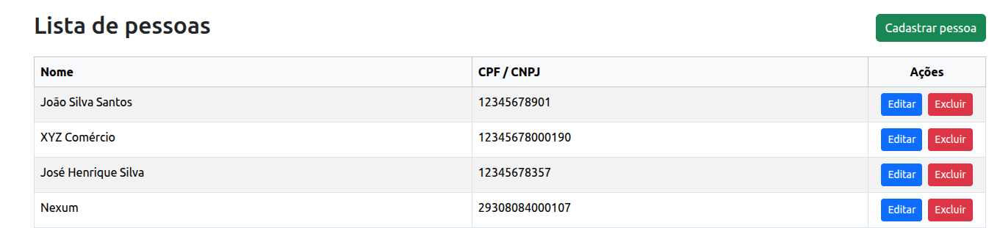

# Cadastro de pessoas



## Sobre o projeto

Sistema full-stack para gerenciamento de cadastro de pessoas físicas e jurídicas. O projeto é dividido em:

- **Backend**: APIs RESTful desenvolvidas em Spring Boot seguindo princípios de Clean Architecture
- **Frontend**: Interface web desenvolvida em Vue.js 3 com TypeScript

## Tecnologias utilizadas

### Backend
- **Java 21**
- **Spring Boot 4.0.1**
- **Maven** 

### Frontend
- **Vue.js 3**
- **TypeScript**
- **Bootstrap**

## Funcionalidades

### CRUD de pessoas
- ✅ Criar pessoa (física ou jurídica)
- ✅ Atualizar pessoa
- ✅ Buscar pessoa por ID
- ✅ Listar todas as pessoas
- ✅ Deletar pessoa

## Clonando o projeto

Clone o repositório para sua máquina local:

```bash
git clone https://github.com/f3l1pe-augusto/cadastro-pessoas.git
cd cadastro-pessoas
```

## 🔧 Como executar

### Pré-requisitos

#### Backend
- Java 21 ou superior
- Maven 3.6+

#### Frontend
- Node.js 20.19+ ou 22.12+
- npm ou yarn

### Executando o backend

1. Navegue até a pasta do backend:
```bash
cd backend
```

2. Execute o projeto:
```bash
./mvnw spring-boot:run
```

Ou no Windows:
```bash
mvnw.cmd spring-boot:run
```

3. A API estará disponível em:
```
http://localhost:8080/cadastro-pessoas/api
```

### Executando o frontend

1. Navegue até a pasta do frontend:
```bash
cd frontend
```

2. Instale as dependências:
```bash
npm install
```

3. Execute em modo de desenvolvimento:
```bash
npm run dev
```

4. A aplicação estará disponível em:
```
http://localhost:5173
```

## Banco de dados

O projeto utiliza **H2 Database** em modo arquivo para persistência de dados.

### Configurações

- **URL**: `jdbc:h2:file:./data/cadastro_pessoas_db`
- **Driver**: `org.h2.Driver`
- **Usuário**: `sa`
- **Senha**: `password`
- **DDL Auto**: `update` (mantém os dados entre execuções)
- **Localização do arquivo**: `./data/cadastro_pessoas_db.mv.db`

## API Endpoints

O projeto inclui um arquivo HTTP Client na pasta `backend/http-client/pessoa/pessoa.http` com exemplos prontos de requisições para testar todos os endpoints.

Use este arquivo com clientes HTTP como:
- IntelliJ IDEA HTTP Client
- VS Code REST Client extension
- Ou qualquer ferramenta similar
